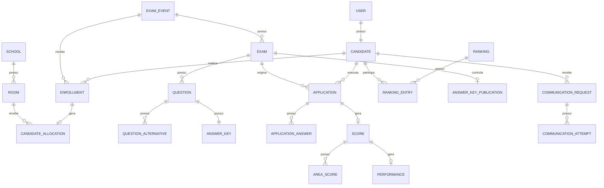
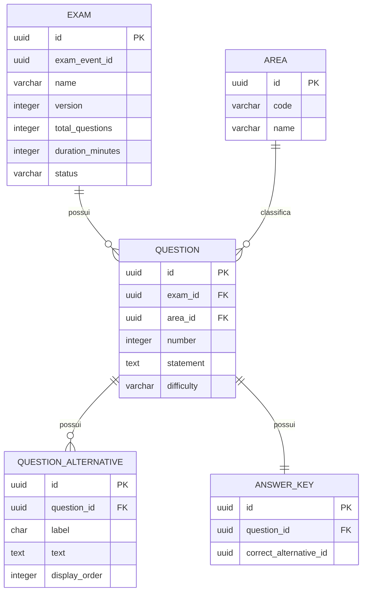
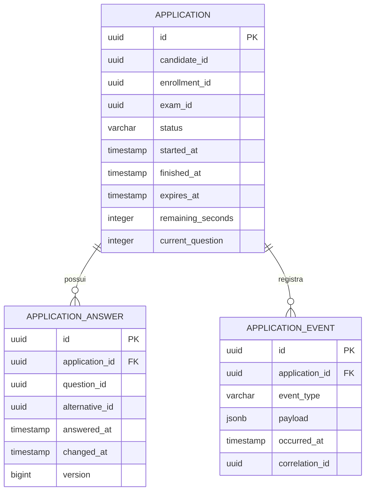
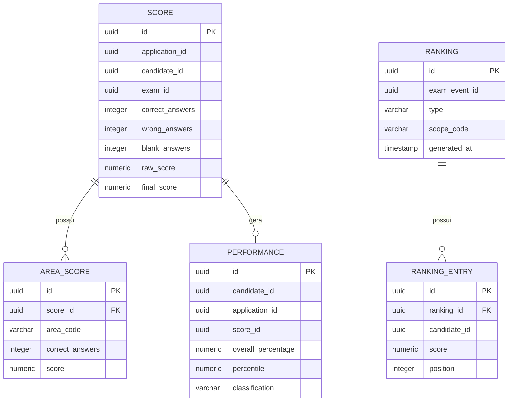

# Banco de Dados — Dia D Simulation

Documentação da camada de persistência do **Dia D Simulation**, com foco nos bancos utilizados pelos serviços, tabelas, campos, relacionamentos e visão geral dos dados da plataforma.

---

## Sumário

1. [Visão geral](#1-visão-geral)  
2. [Estratégia de persistência](#2-estratégia-de-persistência)  
3. [Bancos por serviço](#3-bancos-por-serviço)  
4. [Auth Service](#4-auth-service)  
5. [Candidate Service](#5-candidate-service)  
6. [Enrollment Service](#6-enrollment-service)  
7. [Allocation Service](#7-allocation-service)  
8. [Exam Service](#8-exam-service)  
9. [Application Service](#9-application-service)  
10. [Orchestrator Service](#10-orchestrator-service)  
11. [Scoring Service](#11-scoring-service)  
12. [Performance Service](#12-performance-service)  
13. [Ranking Service](#13-ranking-service)  
14. [Answer Key Service](#14-answer-key-service)  
15. [Communication Service](#15-communication-service)  
16. [Audit Service](#16-audit-service)  
17. [Redis](#17-redis)  
18. [DER geral](#18-der-geral)  
19. [DER da prova](#19-der-da-prova)  
20. [DER da aplicação](#20-der-da-aplicação)  
21. [DER de resultados](#21-der-de-resultados)  
22. [Versionamento com Flyway](#22-versionamento-com-flyway)  
23. [Índices e constraints](#23-índices-e-constraints)  
24. [Auditoria e rastreabilidade](#24-auditoria-e-rastreabilidade)  
25. [Resumo da arquitetura de dados](#25-resumo-da-arquitetura-de-dados)

---

# 1. Visão geral

O Dia D Simulation utiliza bancos separados por domínio.

```text
Auth Service          -> auth_db
Candidate Service     -> candidate_db
Enrollment Service    -> enrollment_db
Allocation Service    -> allocation_db
Exam Service          -> exam_db
Application Service   -> application_db
Orchestrator Service  -> orchestrator_db
Scoring Service       -> scoring_db
Performance Service   -> performance_db
Ranking Service       -> ranking_db
Answer Key Service    -> answer_key_db
Communication Service -> communication_db
Audit Service         -> audit_db
```

Cada serviço é responsável exclusivamente pelo próprio banco.

---

# 2. Estratégia de persistência

Tecnologias principais:

```text
PostgreSQL
Redis
Flyway
JPA / Hibernate
UUID
```

Princípios adotados:

```text
Database per Service
Schema versionado
UUID como identificador
Auditoria de alterações
Cache temporário no Redis
Sem acesso direto ao banco de outro serviço
```

---

# 3. Bancos por serviço

| Serviço | Banco | Responsabilidade |
|---|---|---|
| Auth | `auth_db` | Autenticação e autorização |
| Candidate | `candidate_db` | Dados do participante |
| Enrollment | `enrollment_db` | Inscrição no simulado |
| Allocation | `allocation_db` | Escola, sala e assento |
| Exam | `exam_db` | Provas, questões e alternativas |
| Application | `application_db` | Execução da prova e respostas |
| Orchestrator | `orchestrator_db` | Controle dos workflows |
| Scoring | `scoring_db` | Correção e pontuação |
| Performance | `performance_db` | Desempenho do participante |
| Ranking | `ranking_db` | Classificação |
| Answer Key | `answer_key_db` | Liberação do gabarito |
| Communication | `communication_db` | Comunicações |
| Audit | `audit_db` | Auditoria |

---

# 4. Auth Service

## Banco

```text
auth_db
```

## `users`

| Campo | Tipo |
|---|---|
| `id` | UUID |
| `email` | VARCHAR(255) |
| `password_hash` | VARCHAR(255) |
| `status` | VARCHAR(30) |
| `email_verified` | BOOLEAN |
| `last_login_at` | TIMESTAMP |
| `created_at` | TIMESTAMP |
| `updated_at` | TIMESTAMP |

## `roles`

| Campo | Tipo |
|---|---|
| `id` | UUID |
| `name` | VARCHAR(50) |
| `description` | VARCHAR(255) |

## `user_roles`

| Campo | Tipo |
|---|---|
| `user_id` | UUID |
| `role_id` | UUID |

---

# 5. Candidate Service

## Banco

```text
candidate_db
```

## `candidates`

| Campo | Tipo |
|---|---|
| `id` | UUID |
| `user_id` | UUID |
| `full_name` | VARCHAR(255) |
| `document` | VARCHAR(20) |
| `birth_date` | DATE |
| `phone` | VARCHAR(30) |
| `email` | VARCHAR(255) |
| `city` | VARCHAR(120) |
| `state` | CHAR(2) |
| `status` | VARCHAR(30) |
| `created_at` | TIMESTAMP |
| `updated_at` | TIMESTAMP |

---

# 6. Enrollment Service

## Banco

```text
enrollment_db
```

## `exam_events`

| Campo | Tipo |
|---|---|
| `id` | UUID |
| `name` | VARCHAR(150) |
| `registration_start_at` | TIMESTAMP |
| `registration_end_at` | TIMESTAMP |
| `exam_start_at` | TIMESTAMP |
| `exam_end_at` | TIMESTAMP |
| `status` | VARCHAR(30) |
| `created_at` | TIMESTAMP |
| `updated_at` | TIMESTAMP |

## `enrollments`

| Campo | Tipo |
|---|---|
| `id` | UUID |
| `candidate_id` | UUID |
| `exam_event_id` | UUID |
| `municipality_code` | VARCHAR(20) |
| `status` | VARCHAR(30) |
| `registered_at` | TIMESTAMP |
| `cancelled_at` | TIMESTAMP |
| `created_at` | TIMESTAMP |
| `updated_at` | TIMESTAMP |

---

# 7. Allocation Service

## Banco

```text
allocation_db
```

## `municipalities`

| Campo | Tipo |
|---|---|
| `id` | UUID |
| `ibge_code` | VARCHAR(10) |
| `name` | VARCHAR(150) |
| `state` | CHAR(2) |

## `schools`

| Campo | Tipo |
|---|---|
| `id` | UUID |
| `municipality_id` | UUID |
| `name` | VARCHAR(255) |
| `address` | VARCHAR(255) |
| `active` | BOOLEAN |

## `rooms`

| Campo | Tipo |
|---|---|
| `id` | UUID |
| `school_id` | UUID |
| `code` | VARCHAR(50) |
| `capacity` | INTEGER |
| `active` | BOOLEAN |

## `candidate_allocations`

| Campo | Tipo |
|---|---|
| `id` | UUID |
| `candidate_id` | UUID |
| `enrollment_id` | UUID |
| `exam_event_id` | UUID |
| `school_id` | UUID |
| `room_id` | UUID |
| `seat_number` | VARCHAR(20) |
| `allocated_at` | TIMESTAMP |
| `status` | VARCHAR(30) |

---

# 8. Exam Service

## Banco

```text
exam_db
```

## `exams`

| Campo | Tipo |
|---|---|
| `id` | UUID |
| `exam_event_id` | UUID |
| `name` | VARCHAR(180) |
| `version` | INTEGER |
| `total_questions` | INTEGER |
| `duration_minutes` | INTEGER |
| `status` | VARCHAR(30) |
| `created_at` | TIMESTAMP |
| `updated_at` | TIMESTAMP |

## `areas`

| Campo | Tipo |
|---|---|
| `id` | UUID |
| `code` | VARCHAR(40) |
| `name` | VARCHAR(150) |

## `questions`

| Campo | Tipo |
|---|---|
| `id` | UUID |
| `exam_id` | UUID |
| `area_id` | UUID |
| `number` | INTEGER |
| `statement` | TEXT |
| `difficulty` | VARCHAR(30) |
| `status` | VARCHAR(30) |
| `created_at` | TIMESTAMP |
| `updated_at` | TIMESTAMP |

## `question_alternatives`

| Campo | Tipo |
|---|---|
| `id` | UUID |
| `question_id` | UUID |
| `label` | CHAR(1) |
| `text` | TEXT |
| `display_order` | INTEGER |

## `answer_keys`

| Campo | Tipo |
|---|---|
| `id` | UUID |
| `question_id` | UUID |
| `correct_alternative_id` | UUID |
| `created_at` | TIMESTAMP |

---

# 9. Application Service

## Banco

```text
application_db
```

## `applications`

| Campo | Tipo |
|---|---|
| `id` | UUID |
| `candidate_id` | UUID |
| `enrollment_id` | UUID |
| `exam_id` | UUID |
| `status` | VARCHAR(30) |
| `started_at` | TIMESTAMP |
| `finished_at` | TIMESTAMP |
| `expires_at` | TIMESTAMP |
| `remaining_seconds` | INTEGER |
| `current_question` | INTEGER |
| `last_activity_at` | TIMESTAMP |
| `created_at` | TIMESTAMP |
| `updated_at` | TIMESTAMP |

## `application_answers`

| Campo | Tipo |
|---|---|
| `id` | UUID |
| `application_id` | UUID |
| `question_id` | UUID |
| `alternative_id` | UUID |
| `answered_at` | TIMESTAMP |
| `changed_at` | TIMESTAMP |
| `version` | BIGINT |

## `application_events`

| Campo | Tipo |
|---|---|
| `id` | UUID |
| `application_id` | UUID |
| `event_type` | VARCHAR(80) |
| `payload` | JSONB |
| `occurred_at` | TIMESTAMP |
| `correlation_id` | UUID |

---

# 10. Orchestrator Service

## Banco

```text
orchestrator_db
```

## `workflows`

| Campo | Tipo |
|---|---|
| `id` | UUID |
| `workflow_type` | VARCHAR(80) |
| `aggregate_id` | UUID |
| `current_step` | VARCHAR(80) |
| `status` | VARCHAR(30) |
| `correlation_id` | UUID |
| `started_at` | TIMESTAMP |
| `finished_at` | TIMESTAMP |
| `created_at` | TIMESTAMP |
| `updated_at` | TIMESTAMP |

## `workflow_steps`

| Campo | Tipo |
|---|---|
| `id` | UUID |
| `workflow_id` | UUID |
| `step_name` | VARCHAR(80) |
| `status` | VARCHAR(30) |
| `attempts` | INTEGER |
| `started_at` | TIMESTAMP |
| `finished_at` | TIMESTAMP |
| `error_message` | TEXT |

---

# 11. Scoring Service

## Banco

```text
scoring_db
```

## `scores`

| Campo | Tipo |
|---|---|
| `id` | UUID |
| `application_id` | UUID |
| `candidate_id` | UUID |
| `exam_id` | UUID |
| `total_questions` | INTEGER |
| `correct_answers` | INTEGER |
| `wrong_answers` | INTEGER |
| `blank_answers` | INTEGER |
| `raw_score` | NUMERIC(10,4) |
| `final_score` | NUMERIC(10,4) |
| `status` | VARCHAR(30) |
| `calculated_at` | TIMESTAMP |

## `area_scores`

| Campo | Tipo |
|---|---|
| `id` | UUID |
| `score_id` | UUID |
| `area_code` | VARCHAR(40) |
| `correct_answers` | INTEGER |
| `score` | NUMERIC(10,4) |

## `question_scoring`

| Campo | Tipo |
|---|---|
| `id` | UUID |
| `score_id` | UUID |
| `question_id` | UUID |
| `selected_alternative_id` | UUID |
| `correct_alternative_id` | UUID |
| `correct` | BOOLEAN |
| `points` | NUMERIC(10,4) |

---

# 12. Performance Service

## Banco

```text
performance_db
```

## `performances`

| Campo | Tipo |
|---|---|
| `id` | UUID |
| `candidate_id` | UUID |
| `application_id` | UUID |
| `score_id` | UUID |
| `overall_percentage` | NUMERIC(5,2) |
| `percentile` | NUMERIC(5,2) |
| `classification` | VARCHAR(50) |
| `calculated_at` | TIMESTAMP |

## `area_performances`

| Campo | Tipo |
|---|---|
| `id` | UUID |
| `performance_id` | UUID |
| `area_code` | VARCHAR(40) |
| `percentage` | NUMERIC(5,2) |
| `correct_answers` | INTEGER |
| `wrong_answers` | INTEGER |

---

# 13. Ranking Service

## Banco

```text
ranking_db
```

## `rankings`

| Campo | Tipo |
|---|---|
| `id` | UUID |
| `exam_event_id` | UUID |
| `type` | VARCHAR(30) |
| `scope_code` | VARCHAR(80) |
| `generated_at` | TIMESTAMP |
| `version` | INTEGER |

## `ranking_entries`

| Campo | Tipo |
|---|---|
| `id` | UUID |
| `ranking_id` | UUID |
| `candidate_id` | UUID |
| `score` | NUMERIC(10,4) |
| `position` | INTEGER |
| `percentile` | NUMERIC(5,2) |
| `created_at` | TIMESTAMP |

---

# 14. Answer Key Service

## Banco

```text
answer_key_db
```

## `answer_key_publications`

| Campo | Tipo |
|---|---|
| `id` | UUID |
| `exam_id` | UUID |
| `status` | VARCHAR(30) |
| `available_from` | TIMESTAMP |
| `published_at` | TIMESTAMP |
| `version` | INTEGER |

## `answer_key_access_logs`

| Campo | Tipo |
|---|---|
| `id` | UUID |
| `candidate_id` | UUID |
| `exam_id` | UUID |
| `accessed_at` | TIMESTAMP |
| `correlation_id` | UUID |

---

# 15. Communication Service

## Banco

```text
communication_db
```

## `communication_requests`

| Campo | Tipo |
|---|---|
| `id` | UUID |
| `candidate_id` | UUID |
| `type` | VARCHAR(50) |
| `channel` | VARCHAR(30) |
| `template_code` | VARCHAR(80) |
| `status` | VARCHAR(30) |
| `payload` | JSONB |
| `scheduled_at` | TIMESTAMP |
| `created_at` | TIMESTAMP |

## `communication_attempts`

| Campo | Tipo |
|---|---|
| `id` | UUID |
| `communication_id` | UUID |
| `attempt_number` | INTEGER |
| `status` | VARCHAR(30) |
| `provider_response` | TEXT |
| `attempted_at` | TIMESTAMP |

---

# 16. Audit Service

## Banco

```text
audit_db
```

## `audit_events`

| Campo | Tipo |
|---|---|
| `id` | UUID |
| `service` | VARCHAR(100) |
| `event_type` | VARCHAR(100) |
| `aggregate_type` | VARCHAR(80) |
| `aggregate_id` | UUID |
| `actor_id` | UUID |
| `correlation_id` | UUID |
| `payload` | JSONB |
| `occurred_at` | TIMESTAMP |

---

# 17. Redis

O Redis fica fora do modelo relacional e mantém apenas dados temporários da execução.

Estrutura prevista:

```text
session:{candidateId}

application:{applicationId}:state

application:{applicationId}:lock

rate_limit:{clientId}

ranking:{examEventId}:national

ranking:{examEventId}:state:{uf}

ranking:{examEventId}:city:{municipalityCode}

answer_key:{examId}
```

Os dados definitivos continuam no PostgreSQL.

---

# 18. DER geral



---

# 19. DER da prova



---

# 20. DER da aplicação



---

# 21. DER de resultados



---

# 22. Versionamento com Flyway

Cada serviço possui suas próprias migrations.

```text
src/main/resources/db/migration
```

Exemplo:

```text
V1__create_applications.sql
V2__create_application_answers.sql
V3__create_application_events.sql
V4__create_indexes.sql
```

Uma migration já aplicada não deve ser alterada.

---

# 23. Índices e constraints

Principais constraints:

```sql
UNIQUE(candidate_id, exam_event_id)
```

```sql
UNIQUE(application_id, question_id)
```

```sql
CHECK(capacity > 0)
```

Principais índices:

```sql
CREATE INDEX idx_application_candidate
ON applications(candidate_id);

CREATE INDEX idx_application_exam
ON applications(exam_id);

CREATE INDEX idx_application_answers_application
ON application_answers(application_id);

CREATE INDEX idx_scores_candidate
ON scores(candidate_id);

CREATE INDEX idx_ranking_entries_position
ON ranking_entries(ranking_id, position);
```

---

# 24. Auditoria e rastreabilidade

Os principais registros da plataforma devem carregar:

```text
created_at
updated_at
correlation_id
```

Quando aplicável:

```text
started_at
finished_at
cancelled_at
calculated_at
published_at
occurred_at
```

O `correlation_id` permite rastrear uma operação entre os diferentes serviços.

---

# 25. Resumo da arquitetura de dados

```text
Candidate
   |
   v
Enrollment
   |
   v
Allocation
   |
   v
Exam
   |
   v
Application
   |
   v
Scoring
   |
   v
Performance
   |
   v
Ranking
   |
   v
Answer Key
   |
   v
Communication
```

Persistência principal:

```text
PostgreSQL
```

Dados temporários:

```text
Redis
```

Versionamento:

```text
Flyway
```

Modelo adotado:

```text
Database per Service
```

Cada serviço mantém seu próprio banco, suas próprias tabelas e sua própria evolução de schema.
