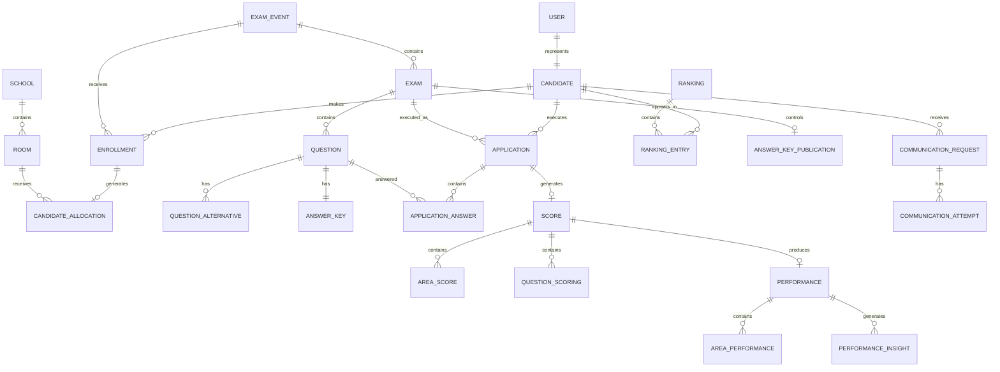
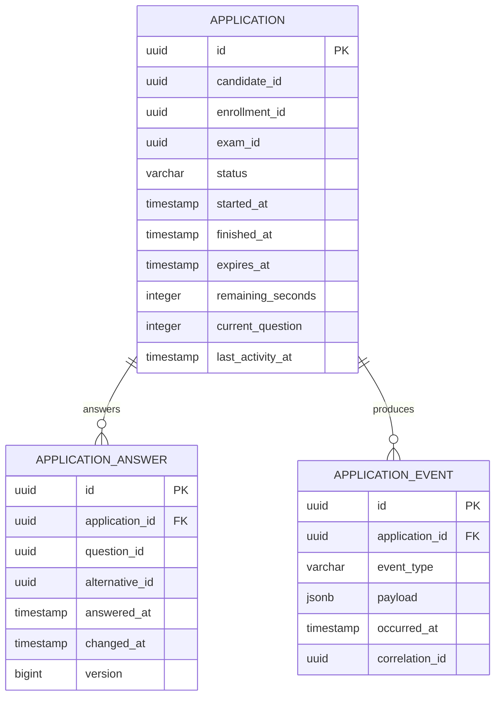
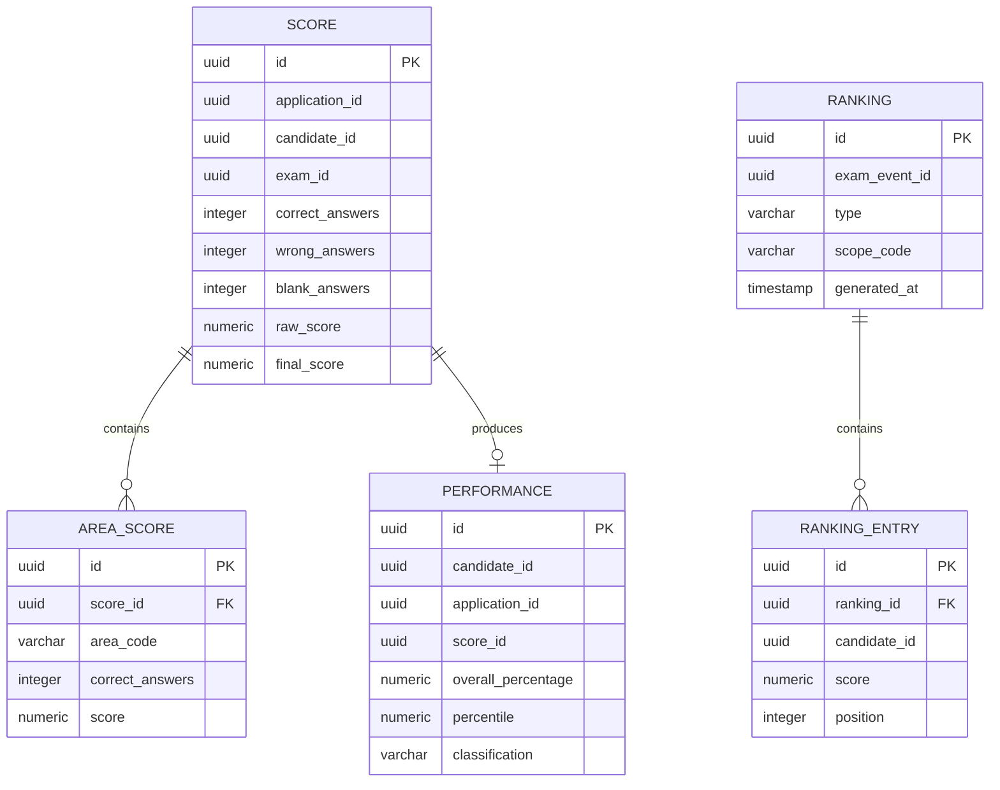
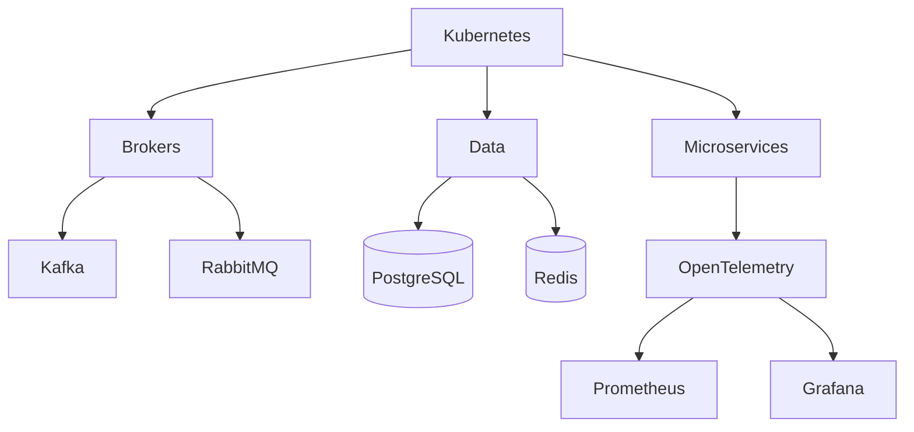
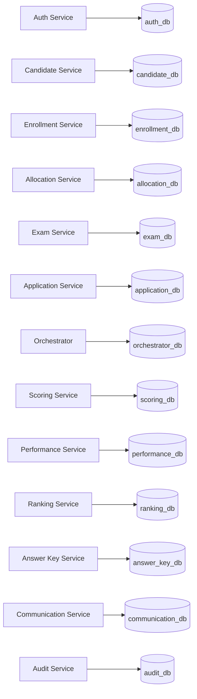

# Banco de Dados — Dia D Simulation

> Documentação de referência da camada de persistência da plataforma **Dia D Simulation**.
>
> Este documento concentra a visão de bancos de dados, ownership por serviço, tabelas, campos principais, relacionamentos, índices, cache, auditoria, versionamento de schema e diagramas entidade-relacionamento.

---

## 1. Objetivo

O Dia D Simulation utiliza uma arquitetura distribuída baseada em microservices.

A estratégia adotada para persistência é **Database per Service**:

```text
Microservice A -> Database A
Microservice B -> Database B
Microservice C -> Database C
```

Cada serviço é proprietário do seu modelo de dados e nenhum outro serviço deve acessar diretamente suas tabelas.

Integrações entre domínios devem acontecer por:

- APIs REST;
- eventos Kafka;
- comandos/mensagens assíncronas;
- contratos versionados.

Isso reduz acoplamento entre domínios e permite que cada serviço evolua seu schema de maneira independente.

---

# 2. Tecnologias de persistência

## PostgreSQL

Banco relacional principal para dados transacionais.

Uso recomendado:

- usuários;
- inscrições;
- aplicações;
- provas;
- respostas;
- resultados;
- ranking;
- configurações persistentes;
- histórico operacional.

## Redis

Armazenamento em memória utilizado para dados temporários e acesso de baixa latência.

Uso recomendado:

- cache;
- sessões temporárias;
- rate limit;
- locks distribuídos;
- dados temporários de execução;
- ranking materializado;
- dados com TTL.

## Kafka

Kafka **não é banco de dados transacional**, mas faz parte da arquitetura de dados como log distribuído de eventos.

Exemplos:

```text
ApplicationStarted
ApplicationFinished
AnswerSubmitted
ScoringRequested
ScoringFinished
PerformanceCalculated
RankingUpdated
AnswerKeyReleased
ResultAvailable
CommunicationRequested
```

---

# 3. Visão geral dos bancos

| Serviço / componente | Banco | Responsabilidade |
|---|---|---|
| Auth Service | `auth_db` | Identidade, credenciais, perfis e refresh tokens |
| Candidate Service | `candidate_db` | Dados cadastrais do participante |
| Enrollment Service | `enrollment_db` | Inscrição do participante no simulado |
| Allocation Service | `allocation_db` | Município, escola, sala e alocação virtual |
| Exam Service | `exam_db` | Provas, áreas, questões, alternativas e gabarito interno |
| Application Service | `application_db` | Execução da prova pelo candidato |
| Orchestrator Service | `orchestrator_db` | Estado dos workflows distribuídos |
| Scoring Service | `scoring_db` | Correção e pontuação |
| Performance Service | `performance_db` | Indicadores de desempenho |
| Ranking Service | `ranking_db` | Rankings e posições |
| Answer Key Service | `answer_key_db` | Liberação controlada do gabarito |
| Communication Service | `communication_db` | Comunicações e histórico de envio |
| Audit Service | `audit_db` | Auditoria técnica e rastreabilidade |
| API Gateway | Redis | Rate limit/cache técnico; sem banco relacional próprio |
| Observabilidade | Prometheus/Grafana | Métricas e visualização; fora do domínio transacional |

---

# 4. Regras de ownership

```text
auth-service ---------> auth_db
candidate-service ----> candidate_db
enrollment-service ---> enrollment_db
allocation-service ---> allocation_db
exam-service ---------> exam_db
application-service --> application_db
orchestrator-service -> orchestrator_db
scoring-service ------> scoring_db
performance-service --> performance_db
ranking-service ------> ranking_db
answer-key-service ---> answer_key_db
communication-service > communication_db
audit-service --------> audit_db
```

Um serviço pode armazenar IDs externos pertencentes a outros domínios, porém eles são tratados como **referências lógicas**, não como foreign keys entre bancos diferentes.

Exemplo:

```text
application_db.applications.candidate_id
```

O campo identifica um candidato, mas o registro oficial do candidato continua pertencendo ao `candidate-service`.

---

# 5. Auth Service

## Banco

```text
auth_db
```

## Tabela `users`

| Campo | Tipo | Regra |
|---|---|---|
| `id` | UUID | PK |
| `email` | VARCHAR(255) | UNIQUE, NOT NULL |
| `password_hash` | VARCHAR(255) | NOT NULL |
| `status` | VARCHAR(30) | NOT NULL |
| `email_verified` | BOOLEAN | NOT NULL |
| `last_login_at` | TIMESTAMP | NULL |
| `created_at` | TIMESTAMP | NOT NULL |
| `updated_at` | TIMESTAMP | NOT NULL |

## Tabela `roles`

| Campo | Tipo | Regra |
|---|---|---|
| `id` | UUID | PK |
| `name` | VARCHAR(50) | UNIQUE |
| `description` | VARCHAR(255) | NULL |

## Tabela `user_roles`

| Campo | Tipo | Regra |
|---|---|---|
| `user_id` | UUID | FK -> users |
| `role_id` | UUID | FK -> roles |

PK composta:

```text
(user_id, role_id)
```

## Tabela `refresh_tokens`

| Campo | Tipo |
|---|---|
| `id` | UUID |
| `user_id` | UUID |
| `token_hash` | VARCHAR(255) |
| `expires_at` | TIMESTAMP |
| `revoked_at` | TIMESTAMP |
| `created_at` | TIMESTAMP |

---

# 6. Candidate Service

## Banco

```text
candidate_db
```

## Tabela `candidates`

| Campo | Tipo | Regra |
|---|---|---|
| `id` | UUID | PK |
| `user_id` | UUID | UNIQUE |
| `full_name` | VARCHAR(255) | NOT NULL |
| `document` | VARCHAR(20) | UNIQUE |
| `birth_date` | DATE | NOT NULL |
| `phone` | VARCHAR(30) | NULL |
| `email` | VARCHAR(255) | NOT NULL |
| `city` | VARCHAR(120) | NOT NULL |
| `state` | CHAR(2) | NOT NULL |
| `status` | VARCHAR(30) | NOT NULL |
| `created_at` | TIMESTAMP | NOT NULL |
| `updated_at` | TIMESTAMP | NOT NULL |

## Tabela `candidate_preferences`

| Campo | Tipo |
|---|---|
| `id` | UUID |
| `candidate_id` | UUID |
| `accessibility_required` | BOOLEAN |
| `preferred_language` | VARCHAR(20) |
| `timezone` | VARCHAR(60) |
| `created_at` | TIMESTAMP |
| `updated_at` | TIMESTAMP |

---

# 7. Enrollment Service

## Banco

```text
enrollment_db
```

## Tabela `exam_events`

Representa uma edição/dia oficial de simulado.

| Campo | Tipo |
|---|---|
| `id` | UUID |
| `name` | VARCHAR(150) |
| `registration_start_at` | TIMESTAMP |
| `registration_end_at` | TIMESTAMP |
| `exam_start_at` | TIMESTAMP |
| `exam_end_at` | TIMESTAMP |
| `status` | VARCHAR(30) |
| `created_at` | TIMESTAMP |
| `updated_at` | TIMESTAMP |

## Tabela `enrollments`

| Campo | Tipo | Regra |
|---|---|---|
| `id` | UUID | PK |
| `candidate_id` | UUID | NOT NULL |
| `exam_event_id` | UUID | NOT NULL |
| `municipality_code` | VARCHAR(20) | NOT NULL |
| `status` | VARCHAR(30) | NOT NULL |
| `registered_at` | TIMESTAMP | NOT NULL |
| `cancelled_at` | TIMESTAMP | NULL |
| `created_at` | TIMESTAMP | NOT NULL |
| `updated_at` | TIMESTAMP | NOT NULL |

Constraint recomendada:

```sql
UNIQUE(candidate_id, exam_event_id)
```

---

# 8. Allocation Service

## Banco

```text
allocation_db
```

## Tabela `municipalities`

| Campo | Tipo |
|---|---|
| `id` | UUID |
| `ibge_code` | VARCHAR(10) |
| `name` | VARCHAR(150) |
| `state` | CHAR(2) |

## Tabela `schools`

| Campo | Tipo |
|---|---|
| `id` | UUID |
| `municipality_id` | UUID |
| `name` | VARCHAR(255) |
| `address` | VARCHAR(255) |
| `active` | BOOLEAN |
| `created_at` | TIMESTAMP |
| `updated_at` | TIMESTAMP |

## Tabela `rooms`

| Campo | Tipo |
|---|---|
| `id` | UUID |
| `school_id` | UUID |
| `code` | VARCHAR(50) |
| `capacity` | INTEGER |
| `active` | BOOLEAN |

## Tabela `candidate_allocations`

| Campo | Tipo |
|---|---|
| `id` | UUID |
| `candidate_id` | UUID |
| `enrollment_id` | UUID |
| `exam_event_id` | UUID |
| `school_id` | UUID |
| `room_id` | UUID |
| `seat_number` | VARCHAR(20) |
| `allocated_at` | TIMESTAMP |
| `status` | VARCHAR(30) |

---

# 9. Exam Service

## Banco

```text
exam_db
```

## Tabela `exams`

| Campo | Tipo |
|---|---|
| `id` | UUID |
| `exam_event_id` | UUID |
| `name` | VARCHAR(180) |
| `version` | INTEGER |
| `total_questions` | INTEGER |
| `duration_minutes` | INTEGER |
| `status` | VARCHAR(30) |
| `created_at` | TIMESTAMP |
| `updated_at` | TIMESTAMP |

## Tabela `areas`

| Campo | Tipo |
|---|---|
| `id` | UUID |
| `code` | VARCHAR(40) |
| `name` | VARCHAR(150) |

Exemplos:

```text
LINGUAGENS
CIENCIAS_HUMANAS
CIENCIAS_NATUREZA
MATEMATICA
```

## Tabela `questions`

| Campo | Tipo |
|---|---|
| `id` | UUID |
| `exam_id` | UUID |
| `area_id` | UUID |
| `number` | INTEGER |
| `statement` | TEXT |
| `difficulty` | VARCHAR(30) |
| `status` | VARCHAR(30) |
| `created_at` | TIMESTAMP |
| `updated_at` | TIMESTAMP |

## Tabela `question_alternatives`

| Campo | Tipo |
|---|---|
| `id` | UUID |
| `question_id` | UUID |
| `label` | CHAR(1) |
| `text` | TEXT |
| `display_order` | INTEGER |

## Tabela `answer_keys`

> O gabarito oficial não deve ser exposto diretamente pelo Exam Service antes do período permitido.

| Campo | Tipo |
|---|---|
| `id` | UUID |
| `question_id` | UUID |
| `correct_alternative_id` | UUID |
| `created_at` | TIMESTAMP |

---

# 10. Application Service

## Banco

```text
application_db
```

Este banco registra a sessão real da prova.

## Tabela `applications`

| Campo | Tipo |
|---|---|
| `id` | UUID |
| `candidate_id` | UUID |
| `enrollment_id` | UUID |
| `exam_id` | UUID |
| `status` | VARCHAR(30) |
| `started_at` | TIMESTAMP |
| `finished_at` | TIMESTAMP |
| `expires_at` | TIMESTAMP |
| `remaining_seconds` | INTEGER |
| `current_question` | INTEGER |
| `last_activity_at` | TIMESTAMP |
| `created_at` | TIMESTAMP |
| `updated_at` | TIMESTAMP |

Possíveis estados:

```text
WAITING
AVAILABLE
IN_PROGRESS
FINISHED
EXPIRED
CANCELLED
```

## Tabela `application_answers`

| Campo | Tipo |
|---|---|
| `id` | UUID |
| `application_id` | UUID |
| `question_id` | UUID |
| `alternative_id` | UUID |
| `answered_at` | TIMESTAMP |
| `changed_at` | TIMESTAMP |
| `version` | BIGINT |

Constraint:

```sql
UNIQUE(application_id, question_id)
```

## Tabela `application_events`

| Campo | Tipo |
|---|---|
| `id` | UUID |
| `application_id` | UUID |
| `event_type` | VARCHAR(80) |
| `payload` | JSONB |
| `occurred_at` | TIMESTAMP |
| `correlation_id` | UUID |

Exemplos:

```text
APPLICATION_STARTED
ANSWER_SELECTED
ANSWER_CHANGED
APPLICATION_FINISHED
APPLICATION_EXPIRED
```

---

# 11. Orchestrator Service

## Banco

```text
orchestrator_db
```

O Orchestrator mantém apenas o estado necessário para coordenar processos distribuídos.

## Tabela `workflows`

| Campo | Tipo |
|---|---|
| `id` | UUID |
| `workflow_type` | VARCHAR(80) |
| `aggregate_id` | UUID |
| `current_step` | VARCHAR(80) |
| `status` | VARCHAR(30) |
| `correlation_id` | UUID |
| `started_at` | TIMESTAMP |
| `finished_at` | TIMESTAMP |
| `created_at` | TIMESTAMP |
| `updated_at` | TIMESTAMP |

## Tabela `workflow_steps`

| Campo | Tipo |
|---|---|
| `id` | UUID |
| `workflow_id` | UUID |
| `step_name` | VARCHAR(80) |
| `status` | VARCHAR(30) |
| `attempts` | INTEGER |
| `started_at` | TIMESTAMP |
| `finished_at` | TIMESTAMP |
| `error_message` | TEXT |

## Tabela `processed_events`

Tabela de idempotência.

| Campo | Tipo |
|---|---|
| `event_id` | UUID |
| `event_type` | VARCHAR(100) |
| `processed_at` | TIMESTAMP |

---

# 12. Scoring Service

## Banco

```text
scoring_db
```

## Tabela `scores`

| Campo | Tipo |
|---|---|
| `id` | UUID |
| `application_id` | UUID |
| `candidate_id` | UUID |
| `exam_id` | UUID |
| `total_questions` | INTEGER |
| `correct_answers` | INTEGER |
| `wrong_answers` | INTEGER |
| `blank_answers` | INTEGER |
| `raw_score` | NUMERIC(10,4) |
| `final_score` | NUMERIC(10,4) |
| `status` | VARCHAR(30) |
| `calculated_at` | TIMESTAMP |

## Tabela `area_scores`

| Campo | Tipo |
|---|---|
| `id` | UUID |
| `score_id` | UUID |
| `area_code` | VARCHAR(40) |
| `total_questions` | INTEGER |
| `correct_answers` | INTEGER |
| `score` | NUMERIC(10,4) |

## Tabela `question_scoring`

| Campo | Tipo |
|---|---|
| `id` | UUID |
| `score_id` | UUID |
| `question_id` | UUID |
| `selected_alternative_id` | UUID |
| `correct_alternative_id` | UUID |
| `correct` | BOOLEAN |
| `points` | NUMERIC(10,4) |

---

# 13. Performance Service

## Banco

```text
performance_db
```

Responsável por dados analíticos derivados do resultado.

## Tabela `performances`

| Campo | Tipo |
|---|---|
| `id` | UUID |
| `candidate_id` | UUID |
| `application_id` | UUID |
| `score_id` | UUID |
| `overall_percentage` | NUMERIC(5,2) |
| `percentile` | NUMERIC(5,2) |
| `classification` | VARCHAR(50) |
| `calculated_at` | TIMESTAMP |

## Tabela `area_performances`

| Campo | Tipo |
|---|---|
| `id` | UUID |
| `performance_id` | UUID |
| `area_code` | VARCHAR(40) |
| `percentage` | NUMERIC(5,2) |
| `correct_answers` | INTEGER |
| `wrong_answers` | INTEGER |

## Tabela `performance_insights`

| Campo | Tipo |
|---|---|
| `id` | UUID |
| `performance_id` | UUID |
| `type` | VARCHAR(50) |
| `message` | TEXT |
| `priority` | INTEGER |

Exemplos:

```text
STRENGTH
WEAKNESS
IMPROVEMENT
```

---

# 14. Ranking Service

## Banco

```text
ranking_db
```

## Tabela `rankings`

| Campo | Tipo |
|---|---|
| `id` | UUID |
| `exam_event_id` | UUID |
| `type` | VARCHAR(30) |
| `scope_code` | VARCHAR(80) |
| `generated_at` | TIMESTAMP |
| `version` | INTEGER |

Possíveis tipos:

```text
NATIONAL
STATE
MUNICIPALITY
SCHOOL
ROOM
```

## Tabela `ranking_entries`

| Campo | Tipo |
|---|---|
| `id` | UUID |
| `ranking_id` | UUID |
| `candidate_id` | UUID |
| `score` | NUMERIC(10,4) |
| `position` | INTEGER |
| `percentile` | NUMERIC(5,2) |
| `created_at` | TIMESTAMP |

Índice recomendado:

```sql
CREATE INDEX idx_ranking_entries_ranking_position
ON ranking_entries(ranking_id, position);
```

### Cache Redis

Exemplo:

```text
ranking:{examEventId}:national
ranking:{examEventId}:state:{uf}
ranking:{examEventId}:city:{municipalityCode}
```

Estrutura recomendada:

```text
Redis Sorted Set
```

---

# 15. Answer Key Service

## Banco

```text
answer_key_db
```

Responsável por controlar quando e como o participante pode visualizar o gabarito.

## Tabela `answer_key_publications`

| Campo | Tipo |
|---|---|
| `id` | UUID |
| `exam_id` | UUID |
| `status` | VARCHAR(30) |
| `available_from` | TIMESTAMP |
| `published_at` | TIMESTAMP |
| `version` | INTEGER |

Estados:

```text
BLOCKED
SCHEDULED
AVAILABLE
REVOKED
```

## Tabela `answer_key_access_logs`

| Campo | Tipo |
|---|---|
| `id` | UUID |
| `candidate_id` | UUID |
| `exam_id` | UUID |
| `accessed_at` | TIMESTAMP |
| `correlation_id` | UUID |

---

# 16. Communication Service

## Banco

```text
communication_db
```

## Tabela `communication_requests`

| Campo | Tipo |
|---|---|
| `id` | UUID |
| `candidate_id` | UUID |
| `type` | VARCHAR(50) |
| `channel` | VARCHAR(30) |
| `template_code` | VARCHAR(80) |
| `status` | VARCHAR(30) |
| `payload` | JSONB |
| `scheduled_at` | TIMESTAMP |
| `created_at` | TIMESTAMP |

Tipos:

```text
REGISTRATION_CONFIRMED
ALLOCATION_AVAILABLE
EXAM_AVAILABLE
EXAM_FINISHED
RESULT_AVAILABLE
ANSWER_KEY_AVAILABLE
```

Canais:

```text
EMAIL
PUSH
SMS
IN_APP
```

## Tabela `communication_attempts`

| Campo | Tipo |
|---|---|
| `id` | UUID |
| `communication_id` | UUID |
| `attempt_number` | INTEGER |
| `status` | VARCHAR(30) |
| `provider_response` | TEXT |
| `attempted_at` | TIMESTAMP |

---

# 17. Audit Service

## Banco

```text
audit_db
```

## Tabela `audit_events`

| Campo | Tipo |
|---|---|
| `id` | UUID |
| `service` | VARCHAR(100) |
| `event_type` | VARCHAR(100) |
| `aggregate_type` | VARCHAR(80) |
| `aggregate_id` | UUID |
| `actor_id` | UUID |
| `correlation_id` | UUID |
| `payload` | JSONB |
| `occurred_at` | TIMESTAMP |

Índices:

```sql
CREATE INDEX idx_audit_correlation
ON audit_events(correlation_id);

CREATE INDEX idx_audit_aggregate
ON audit_events(aggregate_type, aggregate_id);

CREATE INDEX idx_audit_occurred_at
ON audit_events(occurred_at);
```

---

# 18. Outbox Pattern

Serviços que publicam eventos críticos devem utilizar **Transactional Outbox**.

Estrutura padrão:

## Tabela `outbox_events`

| Campo | Tipo |
|---|---|
| `id` | UUID |
| `aggregate_type` | VARCHAR(80) |
| `aggregate_id` | UUID |
| `event_type` | VARCHAR(120) |
| `payload` | JSONB |
| `status` | VARCHAR(30) |
| `attempts` | INTEGER |
| `created_at` | TIMESTAMP |
| `published_at` | TIMESTAMP |
| `last_error` | TEXT |

Estados:

```text
PENDING
PUBLISHED
FAILED
```

Fluxo:

```text
Transação de negócio
       |
       +-- INSERT/UPDATE domínio
       |
       +-- INSERT outbox_events
       |
      COMMIT
       |
       v
Outbox Publisher
       |
       v
Kafka
```

Isso evita inconsistência entre:

```text
salvar no banco
```

e

```text
publicar evento no Kafka
```

---

# 19. Idempotência

Consumers Kafka devem registrar eventos processados quando o processamento não puder ocorrer mais de uma vez.

Tabela padrão:

```sql
CREATE TABLE processed_events (
    event_id UUID PRIMARY KEY,
    event_type VARCHAR(120) NOT NULL,
    processed_at TIMESTAMP NOT NULL DEFAULT CURRENT_TIMESTAMP
);
```

Fluxo:

```text
Evento recebido
      |
      v
event_id já existe?
   /      \
 sim       não
 |          |
ignora   processa
            |
            v
     grava processed_events
```

---

# 20. DER geral da plataforma

> Relacionamentos entre bancos distintos representam **relações lógicas entre domínios**, não foreign keys físicas.



---

# 21. DER — execução da prova



---

# 22. DER — prova


---

# 23. DER — resultado



---

# 24. Estratégia de IDs

IDs públicos devem utilizar:

```text
UUID
```

Motivos:

- independência entre bancos;
- menor dependência de sequência global;
- geração local;
- melhor adequação a sistemas distribuídos.

Exemplo PostgreSQL:

```sql
CREATE EXTENSION IF NOT EXISTS "pgcrypto";

id UUID PRIMARY KEY DEFAULT gen_random_uuid()
```

---

# 25. Campos de auditoria

Tabelas transacionais devem possuir, quando aplicável:

```text
created_at
updated_at
```

Tabelas que representam processos podem ainda possuir:

```text
started_at
finished_at
cancelled_at
published_at
processed_at
```

Padrão recomendado:

```sql
created_at TIMESTAMP NOT NULL DEFAULT CURRENT_TIMESTAMP,
updated_at TIMESTAMP NOT NULL DEFAULT CURRENT_TIMESTAMP
```

---

# 26. Datas e timezone

No código:

```text
UTC
```

Persistência preferencial:

```text
TIMESTAMP WITH TIME ZONE
```

ou padronização explícita em UTC.

Horários apresentados ao usuário devem ser convertidos para o timezone da interface.

---

# 27. Versionamento de schema

Todos os bancos relacionais devem utilizar **Flyway**.

Estrutura:

```text
src/main/resources/db/migration/
```

Exemplo:

```text
V1__create_applications.sql
V2__create_application_answers.sql
V3__create_application_events.sql
V4__create_indexes.sql
```

Regras:

- migration aplicada não deve ser alterada;
- toda mudança recebe uma nova migration;
- DDL deve ser versionada junto ao serviço proprietário;
- deploy deve validar migrations antes da aplicação receber tráfego.

---

# 28. Estratégia de índices

Índices devem refletir padrões reais de consulta.

Exemplos:

```sql
CREATE INDEX idx_application_candidate
ON applications(candidate_id);

CREATE INDEX idx_application_exam
ON applications(exam_id);

CREATE INDEX idx_answers_application
ON application_answers(application_id);

CREATE INDEX idx_scores_candidate
ON scores(candidate_id);

CREATE INDEX idx_ranking_position
ON ranking_entries(ranking_id, position);
```

Evitar criação indiscriminada de índices porque cada índice aumenta o custo de escrita.

---

# 29. Constraints

Exemplos importantes:

```sql
UNIQUE(candidate_id, exam_event_id)
```

Evita inscrição duplicada.

```sql
UNIQUE(application_id, question_id)
```

Garante uma resposta corrente por questão.

```sql
CHECK(capacity > 0)
```

Evita salas inválidas.

```sql
CHECK(position > 0)
```

Evita posições de ranking inválidas.

---

# 30. Concorrência

A execução da prova é uma área sensível a concorrência.

A tabela `application_answers` deve possuir controle de versão:

```text
version BIGINT
```

Com JPA:

```java
@Version
private Long version;
```

Isso reduz risco de sobrescrita silenciosa quando múltiplas requisições tentarem atualizar a mesma resposta.

---

# 31. Redis

Principais chaves previstas:

```text
rate_limit:{clientId}
session:{candidateId}
application:{applicationId}:state
application:{applicationId}:lock
ranking:{examEventId}:national
ranking:{examEventId}:state:{uf}
ranking:{examEventId}:city:{municipalityCode}
answer_key:{examId}
```

TTL deve ser definido conforme o domínio.

Exemplo:

```text
application:* -> duração da prova + margem operacional
rate_limit:*  -> segundos/minutos
session:*     -> duração da sessão
```

Redis não deve ser a fonte definitiva de dados críticos da prova.

---

# 32. Cache

Estratégia:

```text
Request
  |
  v
Redis?
 /   \
hit   miss
 |      |
 v      v
retorna PostgreSQL
          |
          v
        cache
```

Dados adequados para cache:

- informações estáticas de prova;
- configurações;
- municípios;
- escolas;
- ranking;
- resultados já consolidados.

Dados de resposta do candidato devem ser persistidos no PostgreSQL antes de serem considerados confirmados.

---

# 33. Segurança dos dados

Recomendações:

- TLS entre aplicação e banco;
- credenciais fora do código;
- secrets via Kubernetes Secrets ou solução equivalente;
- senha armazenada exclusivamente como hash;
- princípio de menor privilégio;
- usuário de banco específico por serviço;
- bloquear acesso cruzado entre bancos;
- logs sem dados sensíveis desnecessários;
- criptografia de backup;
- política de rotação de credenciais.

---

# 34. Usuários de banco

Exemplo:

```text
auth_service_user
candidate_service_user
enrollment_service_user
allocation_service_user
exam_service_user
application_service_user
orchestrator_service_user
scoring_service_user
performance_service_user
ranking_service_user
answer_key_service_user
communication_service_user
audit_service_user
```

Cada usuário acessa somente seu próprio database/schema.

---

# 35. Backup e recuperação

Para PostgreSQL:

```text
backup completo + WAL / PITR
```

Objetivos recomendados:

```text
RPO: <= 5 minutos
RTO: <= 30 minutos
```

A política final depende do ambiente onde o projeto for implantado.

Dados prioritários:

1. inscrição;
2. aplicação;
3. respostas;
4. scoring;
5. resultados;
6. auditoria.

---

# 36. Retenção

Sugestão de política:

| Dado | Retenção |
|---|---|
| Contas | enquanto ativas + política legal |
| Inscrições | longo prazo |
| Respostas | longo prazo |
| Scores | longo prazo |
| Ranking | histórico por edição |
| Audit events | longo prazo |
| Workflow técnico | 90-180 dias |
| Processed events | 30-90 dias |
| Outbox publicada | 7-30 dias |
| Redis | TTL |

---

# 37. Particionamento

Tabelas com crescimento potencial elevado:

```text
application_events
audit_events
communication_attempts
outbox_events
```

Podem ser particionadas por:

```text
occurred_at
created_at
```

Exemplo mensal:

```text
audit_events_2026_10
audit_events_2026_11
audit_events_2026_12
```

---

# 38. Dados derivados

Dados derivados não devem substituir a fonte original.

Exemplo:

```text
application_answers
        |
        v
     scoring
        |
        v
   performance
        |
        v
     ranking
```

Fonte de verdade:

```text
application_answers
```

Dados derivados:

```text
scores
performances
ranking_entries
```

Se necessário, eles podem ser reconstruídos por reprocessamento.

---

# 39. Fluxo de dados após a finalização da prova

```text
ApplicationFinished
        |
        v
Scoring Service
        |
        v
scoring_db
        |
        v
ScoringFinished
        |
        v
Performance Service
        |
        v
performance_db
        |
        v
PerformanceCalculated
        |
        v
Ranking Service
        |
        v
ranking_db + Redis
        |
        v
ResultAvailable
        |
        +------> Answer Key Service
        |
        +------> Communication Service
```

---

# 40. Consistência

Como os serviços possuem bancos independentes, a plataforma adota:

```text
consistência local forte
+
consistência distribuída eventual
```

Não existem transações ACID entre bancos de microservices.

Coordenação distribuída ocorre por:

- Orchestrator;
- eventos;
- idempotência;
- retries;
- DLQ;
- Outbox Pattern.

---

# 41. Transações

Cada serviço controla somente suas próprias transações.

Exemplo:

```text
application-service
```

Transação:

```text
UPDATE application_answers
INSERT outbox_events
COMMIT
```

Nunca:

```text
BEGIN
application_db
scoring_db
ranking_db
COMMIT
```

---

# 42. Naming convention

## Tabelas

```text
snake_case
plural
```

Exemplos:

```text
application_answers
ranking_entries
communication_attempts
```

## Colunas

```text
snake_case
```

Exemplos:

```text
candidate_id
created_at
correlation_id
```

## Primary Key

```text
id
```

## Foreign Keys internas

```text
<entity>_id
```

---

# 43. Convenção de status

Persistência:

```text
VARCHAR
```

Código:

```text
enum
```

Evitar ordinal.

Correto:

```text
IN_PROGRESS
FINISHED
CANCELLED
```

Evitar:

```text
0
1
2
```

porque alterações na ordem de um enum podem corromper a interpretação histórica.

---

# 44. JSONB

`JSONB` deve ser utilizado somente para dados realmente flexíveis:

```text
event payload
audit payload
provider response
metadata
```

Dados usados frequentemente em filtros e joins devem possuir colunas próprias.

---

# 45. Diagrama da infraestrutura de dados



---

# 46. Diagrama Database per Service



---

# 47. Resumo dos relacionamentos

```text
User
 └── Candidate
      └── Enrollment
           └── Allocation

ExamEvent
 └── Exam
      └── Questions
           ├── Alternatives
           └── AnswerKey

Candidate
 └── Application
      └── ApplicationAnswers

Application
 └── Score
      └── Performance
           └── RankingEntry

Exam
 └── AnswerKeyPublication

Candidate
 └── CommunicationRequest
      └── CommunicationAttempt
```

---

# 48. Princípios da arquitetura de dados

A camada de dados deve preservar os seguintes princípios:

```text
Banco por domínio
Ownership exclusivo
Baixo acoplamento
Schema versionado
Dados críticos persistidos
Cache descartável
Eventos idempotentes
Auditoria ponta a ponta
IDs distribuídos
Consistência eventual explícita
Observabilidade
Recuperação por reprocessamento
```

---

# 49. Checklist de implementação

- [ ] Criar bancos PostgreSQL independentes
- [ ] Criar usuário exclusivo por serviço
- [ ] Configurar Flyway
- [ ] Criar migrations iniciais
- [ ] Criar constraints
- [ ] Criar índices
- [ ] Configurar Redis
- [ ] Implementar Outbox Pattern
- [ ] Implementar idempotência dos consumers
- [ ] Implementar optimistic locking nas respostas
- [ ] Implementar auditoria
- [ ] Configurar backup
- [ ] Configurar retenção
- [ ] Configurar métricas de pool de conexão
- [ ] Configurar alertas de banco
- [ ] Testar migrations em CI
- [ ] Testar restore de backup
- [ ] Validar DER após evolução de cada domínio

---

# 50. Conclusão

A persistência do **Dia D Simulation** segue o princípio de **Database per Service**, mantendo cada domínio responsável por seus próprios dados.

A arquitetura combina:

```text
PostgreSQL
Redis
Kafka
Flyway
Outbox Pattern
Idempotência
Auditoria
Observabilidade
```

A execução da prova possui prioridade máxima de consistência e durabilidade. Respostas submetidas pelo participante são registradas de forma persistente antes de serem consideradas confirmadas.

Os serviços de Scoring, Performance e Ranking trabalham sobre dados derivados e podem ser reprocessados quando necessário, enquanto os dados originais de aplicação e respostas permanecem como a principal fonte de verdade do processo de prova.

---

## Fluxo final

```text
Candidate
   |
   v
Enrollment
   |
   v
Allocation
   |
   v
Exam
   |
   v
Application
   |
   v
ApplicationFinished
   |
   v
Scoring
   |
   v
Performance
   |
   v
Ranking
   |
   v
AnswerKeyAccess
   |
   v
ResultAvailable
   |
   v
Communication
```

