# Eventos Assíncronos — Dia D Simulation

Documentação da comunicação assíncrona do **Dia D Simulation**, com foco em **Kafka**, **RabbitMQ**, eventos de domínio, comandos, tópicos, filas, retries, DLQ, idempotência, versionamento e rastreabilidade.

---

## Sumário

1. [Visão geral](#1-visão-geral)  
2. [Responsabilidade do Kafka e RabbitMQ](#2-responsabilidade-do-kafka-e-rabbitmq)  
3. [Fluxo assíncrono principal](#3-fluxo-assíncrono-principal)  
4. [Padrão dos eventos](#4-padrão-dos-eventos)  
5. [Eventos Kafka](#5-eventos-kafka)  
6. [Application Events](#6-application-events)  
7. [Scoring Events](#7-scoring-events)  
8. [Performance Events](#8-performance-events)  
9. [Ranking Events](#9-ranking-events)  
10. [Answer Key Events](#10-answer-key-events)  
11. [Communication Events](#11-communication-events)  
12. [▤ RabbitMQ](#12-rabbitmq)  
13. [Filas RabbitMQ](#13-filas-rabbitmq)  
14. [🧭 Orchestrator](#14-orchestrator)  
15. [Retry e DLQ](#15-retry-e-dlq)  
16. [Idempotência](#16-idempotência)  
17. [Correlation ID](#17-correlation-id)  
18. [Versionamento dos contratos](#18-versionamento-dos-contratos)  
19. [Nomenclatura](#19-nomenclatura)  
20. [Diagrama Kafka](#20-diagrama-kafka)  
21. [Diagrama RabbitMQ](#21-diagrama-rabbitmq)  
22. [Diagrama geral](#22-diagrama-geral)  
23. [Resumo da arquitetura assíncrona](#23-resumo-da-arquitetura-assíncrona)

---

# 1. Visão geral


A comunicação assíncrona da plataforma utiliza:

- **Kafka** para eventos de domínio;
- **RabbitMQ** para comandos e processamento direcionado;
- **Orchestrator** para controlar workflows distribuídos.

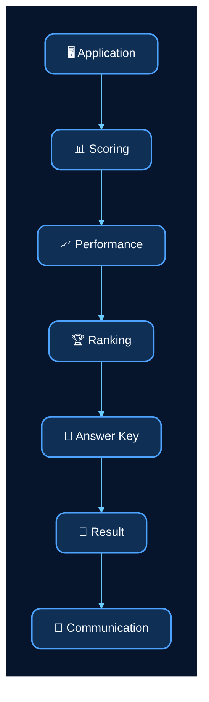

---

# 2. Responsabilidade do Kafka e RabbitMQ

## Kafka

O Kafka transporta **eventos de domínio**, ou seja, fatos que já ocorreram.

Exemplos:

```text
ApplicationStarted
ApplicationFinished
ScoringFinished
PerformanceCalculated
RankingUpdated
AnswerKeyReleased
ResultAvailable
```

Um mesmo evento pode possuir múltiplos consumidores.

## RabbitMQ

O RabbitMQ recebe **comandos assíncronos**, representando ações que devem ser executadas por um serviço específico.

Exemplos:

```text
ProcessScoring
CalculatePerformance
GenerateRanking
ReleaseAnswerKey
SendCommunication
```

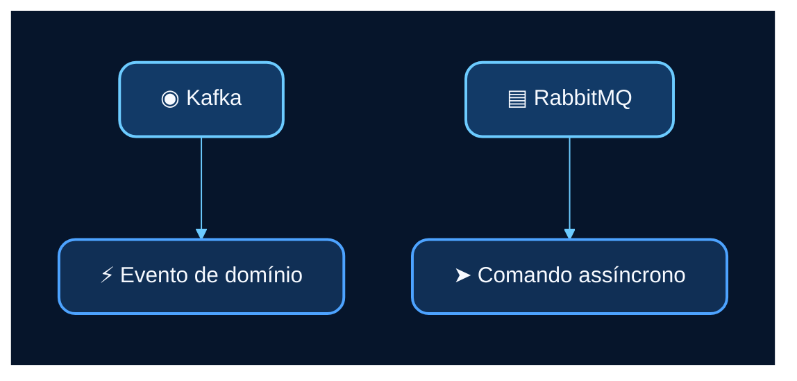

---

# 3. Fluxo assíncrono principal

O fluxo de pós-prova é coordenado pelo Orchestrator.

```mermaid
%%{init: {
  "theme": "base",
  "themeVariables": {
    "background": "#07182D",
    "primaryColor": "#102F55",
    "primaryTextColor": "#F7FAFF",
    "primaryBorderColor": "#4DA3FF",
    "lineColor": "#6CCBFF",
    "secondaryColor": "#123A67",
    "tertiaryColor": "#0A2342",
    "clusterBkg": "#07182D",
    "clusterBorder": "#4DA3FF",
    "edgeLabelBackground": "#07182D",
    "fontFamily": "Inter, Arial"
  },
  "themeCSS": ".mermaid { background: #07182D !important; } svg { background: #07182D !important; } .edgeLabel rect { fill: #07182D !important; } .labelBkg { background: #07182D !important; }"
}}%%
flowchart TB
    subgraph __NAVY_CANVAS__[" "]
    A[🏁 ApplicationFinished]
    B[⚙️ ProcessScoring]
    C[📊 ScoringFinished]
    D[📈 CalculatePerformance]
    E[📈 PerformanceCalculated]
    F[🏆 GenerateRanking]
    G[🏆 RankingUpdated]
    H[🔑 ReleaseAnswerKey]
    I[🔑 AnswerKeyReleased]
    J[📄 ResultAvailable]
    K[💬 SendCommunication]

    A --> B --> C --> D --> E --> F --> G --> H --> I --> J --> K

    end
    style __NAVY_CANVAS__ fill:#06152B,stroke:#06152B,stroke-width:0px,color:#06152B
    classDef event fill:#102F55,stroke:#4DA3FF,stroke-width:2px,color:#F7FAFF,rx:12,ry:12;
    classDef command fill:#123A67,stroke:#6CCBFF,stroke-width:2px,color:#F7FAFF,rx:12,ry:12;

    class A,C,E,G,I,J event;
    class B,D,F,H,K command;
```

---

# 4. Padrão dos eventos

Todos os eventos seguem um envelope comum.

```json
{
  "eventId": "uuid",
  "eventType": "ApplicationFinished",
  "eventVersion": 1,
  "occurredAt": "2026-08-30T17:00:00Z",
  "correlationId": "uuid",
  "aggregateId": "uuid",
  "payload": {}
}
```

| Campo | Descrição |
|---|---|
| `eventId` | Identificador único do evento |
| `eventType` | Tipo do evento |
| `eventVersion` | Versão do contrato |
| `occurredAt` | Data e hora do evento |
| `correlationId` | Identificador de rastreabilidade |
| `aggregateId` | Entidade principal relacionada |
| `payload` | Dados específicos do evento |

---

# 5. Eventos Kafka

| Tópico | Responsabilidade |
|---|---|
| `application.events` | Eventos da execução da prova |
| `scoring.events` | Eventos de correção |
| `performance.events` | Eventos de desempenho |
| `ranking.events` | Eventos de classificação |
| `answer-key.events` | Eventos de gabarito |
| `result.events` | Eventos de resultado |
| `communication.events` | Eventos de comunicação |

---

# 6. Application Events

## `ApplicationStarted`

Publicado quando o candidato inicia a prova.

```json
{
  "applicationId": "uuid",
  "candidateId": "uuid",
  "examId": "uuid",
  "startedAt": "timestamp"
}
```

## `AnswerSubmitted`

Publicado quando uma resposta é registrada.

```json
{
  "applicationId": "uuid",
  "questionId": "uuid",
  "alternativeId": "uuid",
  "answeredAt": "timestamp"
}
```

## `ApplicationFinished`

Publicado quando a prova é finalizada.

```json
{
  "applicationId": "uuid",
  "candidateId": "uuid",
  "examId": "uuid",
  "finishedAt": "timestamp"
}
```

Consumidores principais:

- Orchestrator Service
- Audit Service

---

# 7. Scoring Events

## `ScoringStarted`

```json
{
  "applicationId": "uuid",
  "scoringId": "uuid",
  "startedAt": "timestamp"
}
```

## `ScoringFinished`

```json
{
  "applicationId": "uuid",
  "candidateId": "uuid",
  "examId": "uuid",
  "scoreId": "uuid",
  "finalScore": 782.45,
  "finishedAt": "timestamp"
}
```

Consumidores principais:

- Orchestrator Service
- Performance Service
- Audit Service

## `ScoringFailed`

```json
{
  "applicationId": "uuid",
  "scoringId": "uuid",
  "reason": "string",
  "failedAt": "timestamp"
}
```

---

# 8. Performance Events

## `PerformanceCalculated`

```json
{
  "candidateId": "uuid",
  "applicationId": "uuid",
  "scoreId": "uuid",
  "performanceId": "uuid",
  "overallPercentage": 81.50,
  "percentile": 92.30,
  "calculatedAt": "timestamp"
}
```

Consumidores:

- Orchestrator Service
- Ranking Service
- Audit Service

---

# 9. Ranking Events

## `RankingUpdated`

```json
{
  "candidateId": "uuid",
  "examEventId": "uuid",
  "rankingId": "uuid",
  "position": 152,
  "score": 782.45,
  "updatedAt": "timestamp"
}
```

Consumidores:

- Orchestrator Service
- Audit Service

---

# 10. Answer Key Events

## `AnswerKeyReleased`

```json
{
  "examId": "uuid",
  "publicationId": "uuid",
  "version": 1,
  "releasedAt": "timestamp"
}
```

Consumidores:

- Orchestrator Service
- Communication Service
- Audit Service

---

# 11. Communication Events

## `ResultAvailable`

Publicado quando o resultado final está disponível para consulta.

```json
{
  "candidateId": "uuid",
  "applicationId": "uuid",
  "scoreId": "uuid",
  "performanceId": "uuid",
  "availableAt": "timestamp"
}
```

Consumidores:

- Communication Service
- Audit Service

## `CommunicationSent`

```json
{
  "communicationId": "uuid",
  "candidateId": "uuid",
  "channel": "EMAIL",
  "sentAt": "timestamp"
}
```

## `CommunicationFailed`

```json
{
  "communicationId": "uuid",
  "candidateId": "uuid",
  "channel": "EMAIL",
  "reason": "string",
  "failedAt": "timestamp"
}
```

---

# 12. RabbitMQ

O RabbitMQ executa o processamento direcionado dos comandos.

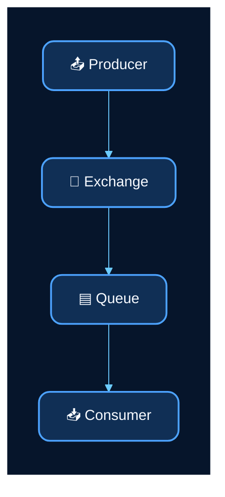

Exchanges principais:

```text
dia-d.commands
dia-d.retry
dia-d.dlx
```

---

# 13. Filas RabbitMQ

| Fila | Consumidor |
|---|---|
| `scoring.process.queue` | Scoring Service |
| `performance.calculate.queue` | Performance Service |
| `ranking.generate.queue` | Ranking Service |
| `answer-key.release.queue` | Answer Key Service |
| `communication.send.queue` | Communication Service |

## `scoring.process.queue`

```json
{
  "commandId": "uuid",
  "applicationId": "uuid",
  "candidateId": "uuid",
  "examId": "uuid",
  "correlationId": "uuid"
}
```

## `performance.calculate.queue`

```json
{
  "commandId": "uuid",
  "candidateId": "uuid",
  "applicationId": "uuid",
  "scoreId": "uuid",
  "correlationId": "uuid"
}
```

## `ranking.generate.queue`

```json
{
  "commandId": "uuid",
  "candidateId": "uuid",
  "examEventId": "uuid",
  "performanceId": "uuid",
  "correlationId": "uuid"
}
```

## `answer-key.release.queue`

```json
{
  "commandId": "uuid",
  "examId": "uuid",
  "correlationId": "uuid"
}
```

## `communication.send.queue`

```json
{
  "commandId": "uuid",
  "candidateId": "uuid",
  "communicationType": "RESULT_AVAILABLE",
  "channel": "EMAIL",
  "correlationId": "uuid"
}
```

---

# 14. Orchestrator

O Orchestrator coordena a sequência do workflow assíncrono.

```mermaid
%%{init: {
  "theme": "base",
  "themeVariables": {
    "background": "#07182D",
    "primaryColor": "#102F55",
    "primaryTextColor": "#F7FAFF",
    "primaryBorderColor": "#4DA3FF",
    "lineColor": "#6CCBFF",
    "secondaryColor": "#123A67",
    "tertiaryColor": "#0A2342",
    "clusterBkg": "#07182D",
    "clusterBorder": "#4DA3FF",
    "edgeLabelBackground": "#07182D",
    "fontFamily": "Inter, Arial"
  },
  "themeCSS": ".mermaid { background: #07182D !important; } svg { background: #07182D !important; } .edgeLabel rect { fill: #07182D !important; } .labelBkg { background: #07182D !important; }"
}}%%
flowchart TB
    subgraph __NAVY_CANVAS__[" "]
    E[⚡ Evento]
    W[⛓ Workflow]
    Q[➤ Comando RabbitMQ]
    S[⚙️ Serviço de domínio]
    K[◉ Evento Kafka]
    N[➡ Próxima etapa]

    E --> W --> Q --> S --> K --> N

    end
    style __NAVY_CANVAS__ fill:#06152B,stroke:#06152B,stroke-width:0px,color:#06152B
    classDef event fill:#102F55,stroke:#4DA3FF,stroke-width:2px,color:#F7FAFF,rx:12,ry:12;
    classDef command fill:#123A67,stroke:#6CCBFF,stroke-width:2px,color:#F7FAFF,rx:12,ry:12;

    class E,W,S,K,N event;
    class Q command;
```

Exemplo aplicado:

```mermaid
%%{init: {
  "theme": "base",
  "themeVariables": {
    "background": "#07182D",
    "primaryColor": "#102F55",
    "primaryTextColor": "#F7FAFF",
    "primaryBorderColor": "#4DA3FF",
    "lineColor": "#6CCBFF",
    "secondaryColor": "#123A67",
    "tertiaryColor": "#0A2342",
    "clusterBkg": "#07182D",
    "clusterBorder": "#4DA3FF",
    "edgeLabelBackground": "#07182D",
    "fontFamily": "Inter, Arial"
  },
  "themeCSS": ".mermaid { background: #07182D !important; } svg { background: #07182D !important; } .edgeLabel rect { fill: #07182D !important; } .labelBkg { background: #07182D !important; }"
}}%%
flowchart TB
    subgraph __NAVY_CANVAS__[" "]
    A[🏁 ApplicationFinished]
    O1[🧭 Orchestrator]
    C[⚙️ ProcessScoring]
    S[📊 Scoring Service]
    E[📊 ScoringFinished]
    O2[🧭 Orchestrator]
    P[📈 CalculatePerformance]

    A --> O1 --> C --> S --> E --> O2 --> P

    end
    style __NAVY_CANVAS__ fill:#06152B,stroke:#06152B,stroke-width:0px,color:#06152B
    classDef event fill:#102F55,stroke:#4DA3FF,stroke-width:2px,color:#F7FAFF,rx:12,ry:12;
    classDef command fill:#123A67,stroke:#6CCBFF,stroke-width:2px,color:#F7FAFF,rx:12,ry:12;

    class A,O1,S,E,O2 event;
    class C,P command;
```

---

# 15. Retry e DLQ

Falhas temporárias passam por retry antes do envio para DLQ.

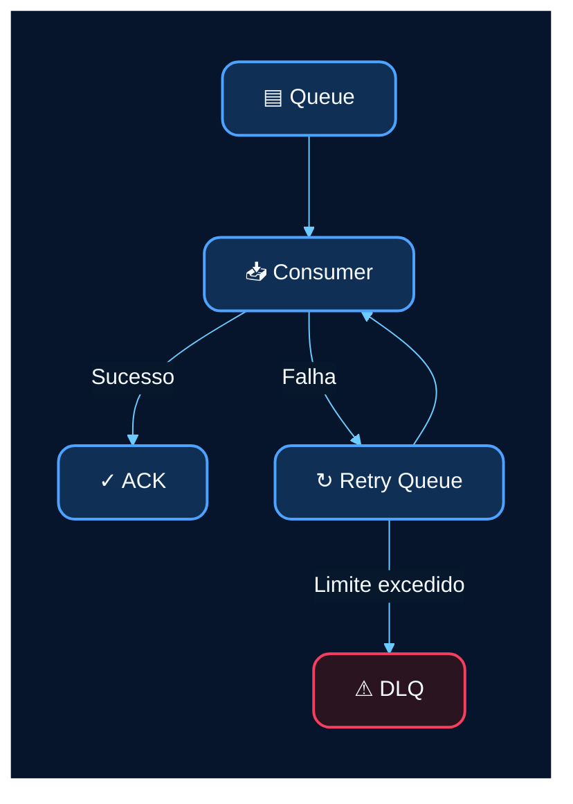

DLQs previstas:

```text
scoring.process.dlq
performance.calculate.dlq
ranking.generate.dlq
answer-key.release.dlq
communication.send.dlq
```

Política inicial:

```text
Tentativa 1 -> 5 segundos
Tentativa 2 -> 30 segundos
Tentativa 3 -> 2 minutos
Tentativa 4 -> DLQ
```

---

# 16. Idempotência

Eventos e comandos podem ser entregues mais de uma vez.

O consumidor deve validar:

```text
eventId
commandId
```

antes de executar novamente.

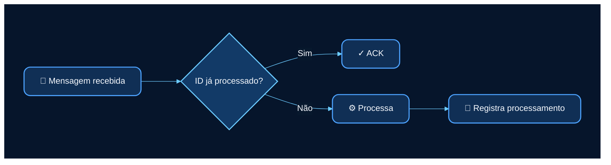

---

# 17. Correlation ID

Todas as mensagens devem transportar:

```text
correlationId
```

O mesmo identificador acompanha todo o workflow.

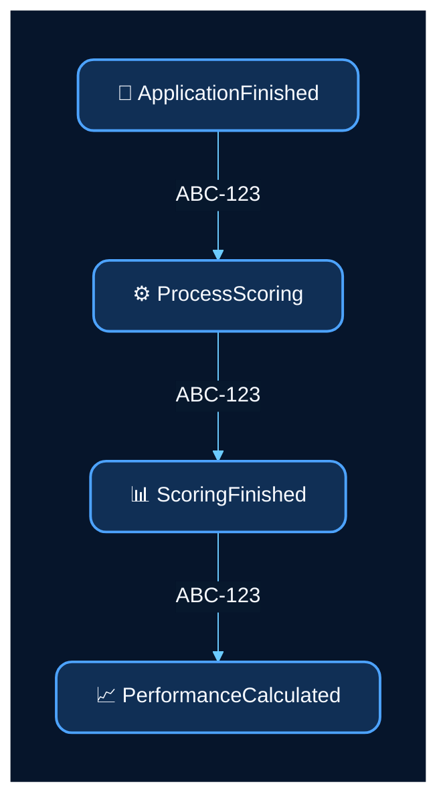

---

# 18. Versionamento dos contratos

Eventos devem possuir versão explícita.

```json
{
  "eventType": "ScoringFinished",
  "eventVersion": 1
}
```

Alterações incompatíveis geram uma nova versão do contrato:

```text
ScoringFinished v1
ScoringFinished v2
```

---

# 19. Nomenclatura

## Eventos

Formato:

```text
PascalCase
```

Exemplos:

```text
ApplicationFinished
ScoringFinished
PerformanceCalculated
RankingUpdated
ResultAvailable
```

Eventos representam fatos e utilizam passado.

## Tópicos Kafka

Formato:

```text
<dominio>.events
```

Exemplos:

```text
application.events
scoring.events
performance.events
ranking.events
answer-key.events
result.events
communication.events
```

## Filas RabbitMQ

Formato:

```text
<dominio>.<acao>.queue
```

Exemplos:

```text
scoring.process.queue
performance.calculate.queue
ranking.generate.queue
communication.send.queue
```

DLQ:

```text
<dominio>.<acao>.dlq
```

---

# 20. Diagrama Kafka

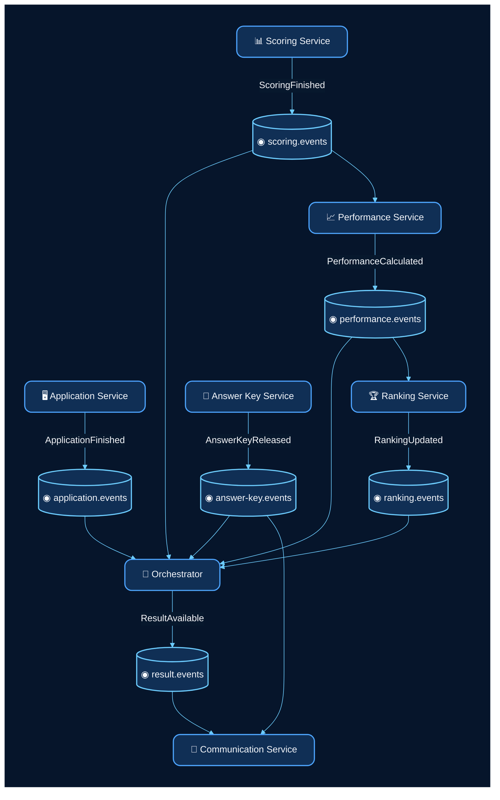

---

# 21. Diagrama RabbitMQ

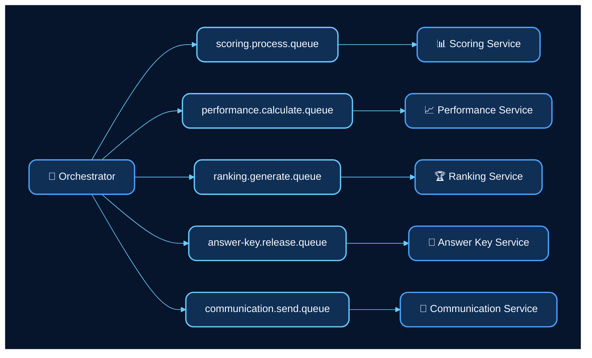

---

# 22. Diagrama geral

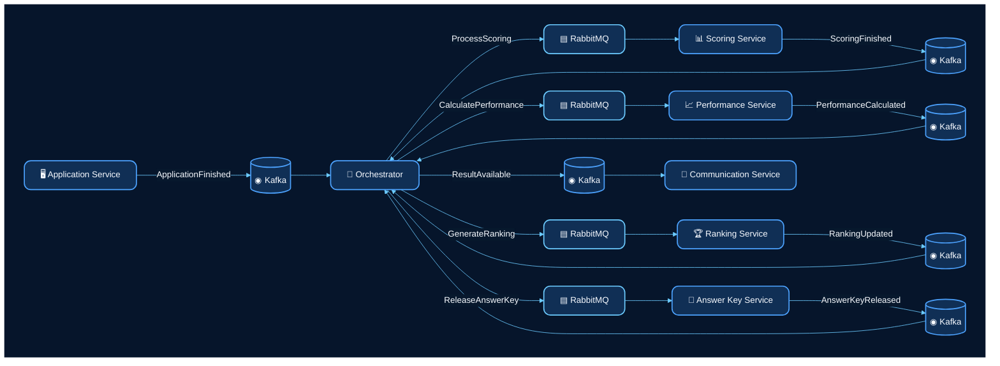

---

# 23. Resumo da arquitetura assíncrona

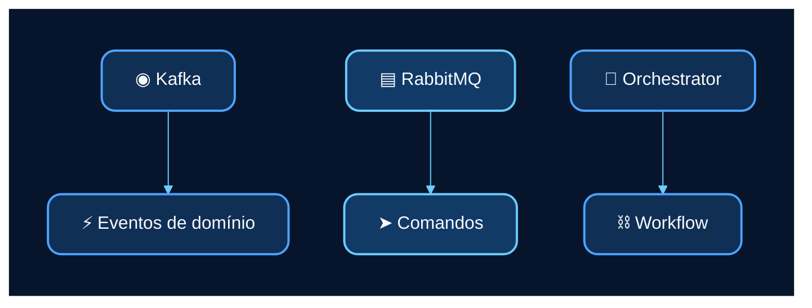

A separação principal é:

```text
Evento = fato ocorrido
Comando = ação a executar
```

No Dia D Simulation:

- **Kafka** propaga eventos de domínio;
- **RabbitMQ** direciona comandos para processamento;
- **Orchestrator** controla a sequência dos workflows;
- **Retry e DLQ** tratam falhas;
- **Idempotência** evita processamento duplicado;
- **Correlation ID** garante rastreabilidade entre serviços.
