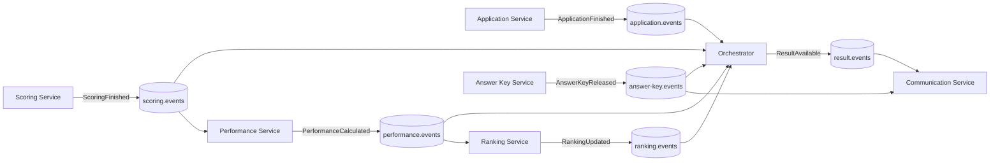
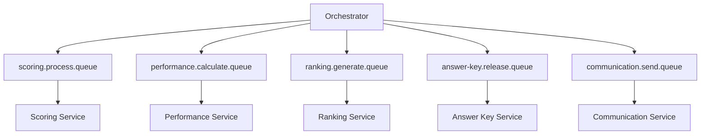
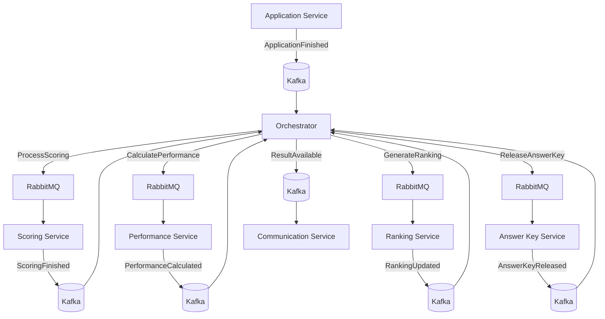

# Eventos Assíncronos — Dia D Simulation

Documentação da comunicação assíncrona do **Dia D Simulation**, com foco no uso de **Kafka** e **RabbitMQ**, eventos de domínio, filas, tópicos, contratos, consumidores, retries, DLQ e rastreabilidade.

---

## Sumário

1. [Visão geral](#1-visão-geral)  
2. [Responsabilidade do Kafka e RabbitMQ](#2-responsabilidade-do-kafka-e-rabbitmq)  
3. [Fluxo assíncrono principal](#3-fluxo-assíncrono-principal)  
4. [Padrão dos eventos](#4-padrão-dos-eventos)  
5. [Eventos Kafka](#5-eventos-kafka)  
6. [Application Events](#6-application-events)  
7. [Scoring Events](#7-scoring-events)  
8. [Performance Events](#8-performance-events)  
9. [Ranking Events](#9-ranking-events)  
10. [Answer Key Events](#10-answer-key-events)  
11. [Communication Events](#11-communication-events)  
12. [RabbitMQ](#12-rabbitmq)  
13. [Filas RabbitMQ](#13-filas-rabbitmq)  
14. [Orchestrator](#14-orchestrator)  
15. [Retry e DLQ](#15-retry-e-dlq)  
16. [Idempotência](#16-idempotência)  
17. [Correlation ID](#17-correlation-id)  
18. [Versionamento dos contratos](#18-versionamento-dos-contratos)  
19. [Nomenclatura](#19-nomenclatura)  
20. [Diagrama Kafka](#20-diagrama-kafka)  
21. [Diagrama RabbitMQ](#21-diagrama-rabbitmq)  
22. [Diagrama geral](#22-diagrama-geral)  
23. [Resumo da arquitetura assíncrona](#23-resumo-da-arquitetura-assíncrona)

---

# 1. Visão geral

A comunicação assíncrona do Dia D Simulation utiliza:

```text
Kafka
RabbitMQ
```

O fluxo principal entre domínios é orientado a eventos.

```text
Application
   |
   v
Scoring
   |
   v
Performance
   |
   v
Ranking
   |
   v
Answer Key
   |
   v
Result
   |
   v
Communication
```

---

# 2. Responsabilidade do Kafka e RabbitMQ

## Kafka

Utilizado para **eventos de domínio** que representam fatos já ocorridos na plataforma.

Exemplos:

```text
ApplicationFinished
ScoringFinished
PerformanceCalculated
RankingUpdated
AnswerKeyReleased
ResultAvailable
```

Um mesmo evento pode ser consumido por mais de um serviço.

---

## RabbitMQ

Utilizado para **comandos assíncronos e processamento direcionado**.

Exemplos:

```text
ProcessScoring
CalculatePerformance
GenerateRanking
ReleaseAnswerKey
SendCommunication
```

O comando possui um consumidor responsável pela execução.

---

# 3. Fluxo assíncrono principal

```text
ApplicationFinished
        |
        v
Orchestrator
        |
        v
ProcessScoring
        |
        v
ScoringFinished
        |
        v
CalculatePerformance
        |
        v
PerformanceCalculated
        |
        v
GenerateRanking
        |
        v
RankingUpdated
        |
        v
ReleaseAnswerKey
        |
        v
AnswerKeyReleased
        |
        v
ResultAvailable
        |
        v
SendCommunication
```

---

# 4. Padrão dos eventos

Todos os eventos devem seguir uma estrutura comum.

```json
{
  "eventId": "uuid",
  "eventType": "ApplicationFinished",
  "eventVersion": 1,
  "occurredAt": "2026-08-30T17:00:00Z",
  "correlationId": "uuid",
  "aggregateId": "uuid",
  "payload": {}
}
```

Campos obrigatórios:

| Campo | Descrição |
|---|---|
| `eventId` | Identificador único do evento |
| `eventType` | Tipo do evento |
| `eventVersion` | Versão do contrato |
| `occurredAt` | Data e hora do evento |
| `correlationId` | Identificador de rastreabilidade |
| `aggregateId` | Entidade principal relacionada |
| `payload` | Dados específicos do evento |

---

# 5. Eventos Kafka

Tópicos principais:

| Tópico | Evento |
|---|---|
| `application.events` | Eventos da aplicação |
| `scoring.events` | Eventos de correção |
| `performance.events` | Eventos de desempenho |
| `ranking.events` | Eventos de ranking |
| `answer-key.events` | Eventos de gabarito |
| `result.events` | Eventos de resultado |
| `communication.events` | Eventos de comunicação |

---

# 6. Application Events

## `ApplicationStarted`

Publicado quando o candidato inicia a prova.

```json
{
  "applicationId": "uuid",
  "candidateId": "uuid",
  "examId": "uuid",
  "startedAt": "timestamp"
}
```

---

## `AnswerSubmitted`

Publicado quando uma resposta é registrada.

```json
{
  "applicationId": "uuid",
  "questionId": "uuid",
  "alternativeId": "uuid",
  "answeredAt": "timestamp"
}
```

---

## `ApplicationFinished`

Publicado quando a prova é finalizada.

```json
{
  "applicationId": "uuid",
  "candidateId": "uuid",
  "examId": "uuid",
  "finishedAt": "timestamp"
}
```

Consumidores principais:

```text
Orchestrator Service
Audit Service
```

---

# 7. Scoring Events

## `ScoringStarted`

```json
{
  "applicationId": "uuid",
  "scoringId": "uuid",
  "startedAt": "timestamp"
}
```

---

## `ScoringFinished`

```json
{
  "applicationId": "uuid",
  "candidateId": "uuid",
  "examId": "uuid",
  "scoreId": "uuid",
  "finalScore": 782.45,
  "finishedAt": "timestamp"
}
```

Consumidores principais:

```text
Orchestrator Service
Performance Service
Audit Service
```

---

## `ScoringFailed`

```json
{
  "applicationId": "uuid",
  "scoringId": "uuid",
  "reason": "string",
  "failedAt": "timestamp"
}
```

---

# 8. Performance Events

## `PerformanceCalculated`

```json
{
  "candidateId": "uuid",
  "applicationId": "uuid",
  "scoreId": "uuid",
  "performanceId": "uuid",
  "overallPercentage": 81.50,
  "percentile": 92.30,
  "calculatedAt": "timestamp"
}
```

Consumidores:

```text
Orchestrator Service
Ranking Service
Audit Service
```

---

# 9. Ranking Events

## `RankingUpdated`

```json
{
  "candidateId": "uuid",
  "examEventId": "uuid",
  "rankingId": "uuid",
  "position": 152,
  "score": 782.45,
  "updatedAt": "timestamp"
}
```

Consumidores:

```text
Orchestrator Service
Result Service
Audit Service
```

---

# 10. Answer Key Events

## `AnswerKeyReleased`

```json
{
  "examId": "uuid",
  "publicationId": "uuid",
  "version": 1,
  "releasedAt": "timestamp"
}
```

Consumidores:

```text
Orchestrator Service
Communication Service
Audit Service
```

---

# 11. Communication Events

## `ResultAvailable`

Publicado quando o resultado final pode ser consultado pelo participante.

```json
{
  "candidateId": "uuid",
  "applicationId": "uuid",
  "scoreId": "uuid",
  "performanceId": "uuid",
  "availableAt": "timestamp"
}
```

Consumidores:

```text
Communication Service
Audit Service
```

---

## `CommunicationSent`

```json
{
  "communicationId": "uuid",
  "candidateId": "uuid",
  "channel": "EMAIL",
  "sentAt": "timestamp"
}
```

---

## `CommunicationFailed`

```json
{
  "communicationId": "uuid",
  "candidateId": "uuid",
  "channel": "EMAIL",
  "reason": "string",
  "failedAt": "timestamp"
}
```

---

# 12. RabbitMQ

RabbitMQ recebe comandos de processamento.

Estrutura:

```text
Producer
   |
   v
Exchange
   |
   v
Queue
   |
   v
Consumer
```

Exchanges principais:

```text
dia-d.commands
dia-d.retry
dia-d.dlx
```

---

# 13. Filas RabbitMQ

| Fila | Responsável |
|---|---|
| `scoring.process.queue` | Scoring Service |
| `performance.calculate.queue` | Performance Service |
| `ranking.generate.queue` | Ranking Service |
| `answer-key.release.queue` | Answer Key Service |
| `communication.send.queue` | Communication Service |

---

## `scoring.process.queue`

Mensagem:

```json
{
  "commandId": "uuid",
  "applicationId": "uuid",
  "candidateId": "uuid",
  "examId": "uuid",
  "correlationId": "uuid"
}
```

---

## `performance.calculate.queue`

```json
{
  "commandId": "uuid",
  "candidateId": "uuid",
  "applicationId": "uuid",
  "scoreId": "uuid",
  "correlationId": "uuid"
}
```

---

## `ranking.generate.queue`

```json
{
  "commandId": "uuid",
  "candidateId": "uuid",
  "examEventId": "uuid",
  "performanceId": "uuid",
  "correlationId": "uuid"
}
```

---

## `answer-key.release.queue`

```json
{
  "commandId": "uuid",
  "examId": "uuid",
  "correlationId": "uuid"
}
```

---

## `communication.send.queue`

```json
{
  "commandId": "uuid",
  "candidateId": "uuid",
  "communicationType": "RESULT_AVAILABLE",
  "channel": "EMAIL",
  "correlationId": "uuid"
}
```

---

# 14. Orchestrator

O Orchestrator controla a sequência dos processos assíncronos.

Fluxo:

```text
Evento
  |
  v
Workflow
  |
  v
Comando RabbitMQ
  |
  v
Serviço de domínio
  |
  v
Evento Kafka
  |
  v
Próxima etapa
```

Exemplo:

```text
ApplicationFinished
      |
      v
Orchestrator
      |
      v
ProcessScoring
      |
      v
Scoring Service
      |
      v
ScoringFinished
      |
      v
Orchestrator
      |
      v
CalculatePerformance
```

---

# 15. Retry e DLQ

Falhas temporárias devem utilizar retry.

Fluxo:

```text
Queue
  |
  v
Consumer
  |
  +---- sucesso ----> ACK
  |
  +---- falha ------> Retry
                        |
                        v
                     Retry Queue
                        |
                        v
                    Consumer
```

Após o limite de tentativas:

```text
DLQ
```

Filas previstas:

```text
scoring.process.dlq
performance.calculate.dlq
ranking.generate.dlq
answer-key.release.dlq
communication.send.dlq
```

Header recomendado:

```text
x-retry-count
```

Exemplo de política:

```text
Tentativa 1 -> 5 segundos
Tentativa 2 -> 30 segundos
Tentativa 3 -> 2 minutos
Tentativa 4 -> DLQ
```

---

# 16. Idempotência

Eventos e comandos podem ser entregues mais de uma vez.

Cada consumidor deve validar o identificador recebido antes de executar novamente.

Identificadores utilizados:

```text
eventId
commandId
```

Fluxo:

```text
Mensagem recebida
      |
      v
ID já processado?
   /        \
 sim        não
 |           |
ACK       processa
             |
             v
      registra processamento
```

---

# 17. Correlation ID

Todas as mensagens devem possuir:

```text
correlationId
```

Exemplo:

```text
ApplicationFinished
        |
        | correlationId = ABC-123
        v
ProcessScoring
        |
        | correlationId = ABC-123
        v
ScoringFinished
        |
        | correlationId = ABC-123
        v
PerformanceCalculated
```

O mesmo identificador acompanha todo o workflow.

---

# 18. Versionamento dos contratos

Eventos devem possuir versão.

```json
{
  "eventType": "ScoringFinished",
  "eventVersion": 1
}
```

Evolução:

```text
ScoringFinished v1
ScoringFinished v2
```

Alterações incompatíveis devem gerar nova versão.

---

# 19. Nomenclatura

## Eventos

Formato:

```text
PascalCase
```

Exemplos:

```text
ApplicationFinished
ScoringFinished
PerformanceCalculated
RankingUpdated
ResultAvailable
```

Eventos representam fatos e devem utilizar passado.

---

## Tópicos Kafka

Formato:

```text
<dominio>.events
```

Exemplos:

```text
application.events
scoring.events
performance.events
ranking.events
answer-key.events
result.events
communication.events
```

---

## Filas RabbitMQ

Formato:

```text
<dominio>.<acao>.queue
```

Exemplos:

```text
scoring.process.queue
performance.calculate.queue
ranking.generate.queue
communication.send.queue
```

DLQ:

```text
<dominio>.<acao>.dlq
```

---

# 20. Diagrama Kafka



---

# 21. Diagrama RabbitMQ



---

# 22. Diagrama geral



---

# 23. Resumo da arquitetura assíncrona

```text
Kafka
  |
  +-- eventos de domínio
  +-- múltiplos consumidores
  +-- histórico de eventos
  +-- integração entre domínios
```

```text
RabbitMQ
  |
  +-- comandos
  +-- processamento direcionado
  +-- filas de trabalho
  +-- retry
  +-- DLQ
```

Fluxo principal:

```text
ApplicationFinished
        |
        v
ProcessScoring
        |
        v
ScoringFinished
        |
        v
CalculatePerformance
        |
        v
PerformanceCalculated
        |
        v
GenerateRanking
        |
        v
RankingUpdated
        |
        v
ReleaseAnswerKey
        |
        v
AnswerKeyReleased
        |
        v
ResultAvailable
        |
        v
SendCommunication
```

A arquitetura separa claramente:

```text
Evento = fato ocorrido
Comando = ação a executar
```

Com isso, Kafka e RabbitMQ possuem responsabilidades distintas dentro do Dia D Simulation.
